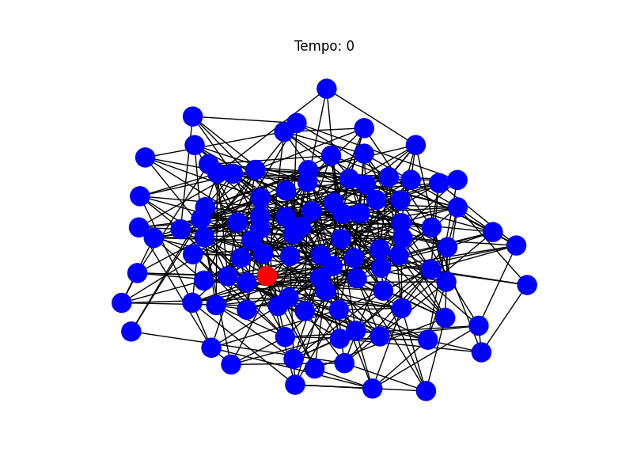

# Epidemic Spread Simulation With Graphs

## Introduction
This study of epidemic propagation in graphs seeks to understand how diseases, information, or behaviors spread in complex networks, such as social networks, biological systems, or transportation infrastructures. Using graph theory, individuals can be represented as vertices and their connections as edges, capturing the dynamics of propagation.

## Objectives
- Analyze how epidemic spread can be modeled using **graphs**
- Study epidemic spread models, especially the **SIR model**
- Present a **Python program** that visually simulates the problem, displaying infection/time graphs, graphs, and animations
- Explore real-world applications and study the effectiveness of **epidemic prevention/control methods** using the proposed model

## SIR Model
Created in 1927 by W. O. Kermack and A. G. McKendrick, the SIR model seeks to model epidemic spread considering only three stages:
- **S(t)** - Susceptible: the individual may still be infected
- **I(t)** - Infected: the individual has the disease
- **R(t)** - Removed: recovered or dead, the individual can no longer be infected

Where **t** is the elapsed time and **N = S(t) + I(t) + R(t)** is the population size. Parameters **β (infection rate)** and **γ (recovery rate)** are also taken into account.

## Scenarios

### Scenario 1 - Basic SIR Model on a Random Graph

This scenario simulates the spread of an infectious disease using the classic SIR (Susceptible-Infected-Recovered) model on an Erdős–Rényi random graph. No additional interventions are applied. The goal is to observe how the **infection progresses** in a fully susceptible network from a single initial infected node.

### Scenario 2 - SIR Model With Weighted Edges

In this simulation, each edge in the random graph is assigned a weight representing the strength or **frequency of contact between individuals**. These weights influence the transmission probability, allowing us to model more realistic and heterogeneous interaction patterns in the network.

#### Social Distancing Mecanism:

No Social Distancing: **(0.2, 0.4, 0.6 0.8)**    
Social Distancing: **(0.1, 0.3, 0.5, 0.9)**

Weights and probabilities example:
- Live together: 0.8 -> 0.9
- Work together: 0.6 -> 0.5
- Same community: 0.4 -> 0.3
- Casual contact: 0.2 -> 0.1

Increases the likelihood of infection among people 
living together and decreases other probabilities

### Scenario 3 - SIR Model with Random Vaccination

This scenario introduces a basic immunization strategy: a random subset of nodes is **preemptively vaccinated** (i.e., marked as recovered from the beginning). This allows analysis of how random immunization affects the disease spread and helps flatten the infection curve.

### Scenario 4 - SIR Model with Targeted Vaccination Based on Centrality

In this case, vaccination is not random. Instead, the most central nodes, those with the highest **closeness centrality**, are vaccinated first. These nodes are more likely to spread the disease quickly if infected. This scenario evaluates the effectiveness of targeted vaccination strategies in reducing epidemic impact.

#### Closeness Centrality

To identify central/important vertices, we analyze their Closeness Centrality, which measures how quickly a vertex can reach others. It is calculated for each vertex as follows:  

     

Where **d(u,y)** is the distance between the vertex being analyzed and the other vertex in question, calculated using **Dijkstra's algorithm**, for example, for shortest paths (this is done for each vertex other than **u**).

However, here we're working with probabilities on each edge, rather than standard weights. Therefore, a shortest path in this case is the one with the highest cumulative probability (we're taking the highest weight, not the lowest). Thus, we need to **invert the weight value** of each edge in the graph for the algorithm to work correctly.

## Results

| Scen. | N   | t  | S.D. | nº S | nº I | k  | % Infected |
|:-----:|:-----:|:----:|:------:|:------:|:------:|:----:|:-----------:|
| 1.1 | 100 | 14 | F    | 0    | 100  | 0  | 100%      |
| 1.2 | 100 | 24 | F    | 0    | 100  | 0  | 100%      |
| 2.1 | 50  | 21 | F    | 9    | 41   | 0  | 82%   
| 2.2 | 50  | 25 | T    | 14   | 36   | 0  | 72%   
| 3.1 | 70  | 20 | F    | 5    | 55   | 10 | 78.6% 
| 3.2 | 70  | 18 | T    | 9    | 51   | 10 | 72.8% 
| 3.3 | 70  | 13 | F    | 37   | 33   | 30 | 47.1% 
| 3.4 | 70  | 14 | T    | 41   | 29   | 30 | 41.4% 
| 4.1 | 70  | 20 | T    | 36   | 34   | 10 | 48.6% 
| 4.2 | 70  | 14 | T    | 57   | 13   | 30 | 18.6%     |

- **N** -> Total population
- **t** -> Duration of the simulation in time steps
- **S.D.** -> Social Distancing (True/False)
- **nº S** -> Final number of susceptible individuals
- **nº I** -> Final number of infected individuals
- **k** -> Number of vaccinated individuals
- **% Infected** -> Percentage of infected people (nºI / N)

## Conclusions

- Modeling epidemic spread using **graphs** can be quite useful and **effective**
- The graph structure has a strong impact on the speed and scope of spread, as can be seen from the **central vertices**
- Control/prevention **strategies can be optimized** based on simulations and their respective results
- More complex models (SEIR, with vaccination, quarantine, lockdown) can be implemented and **increase the realism** of the situation